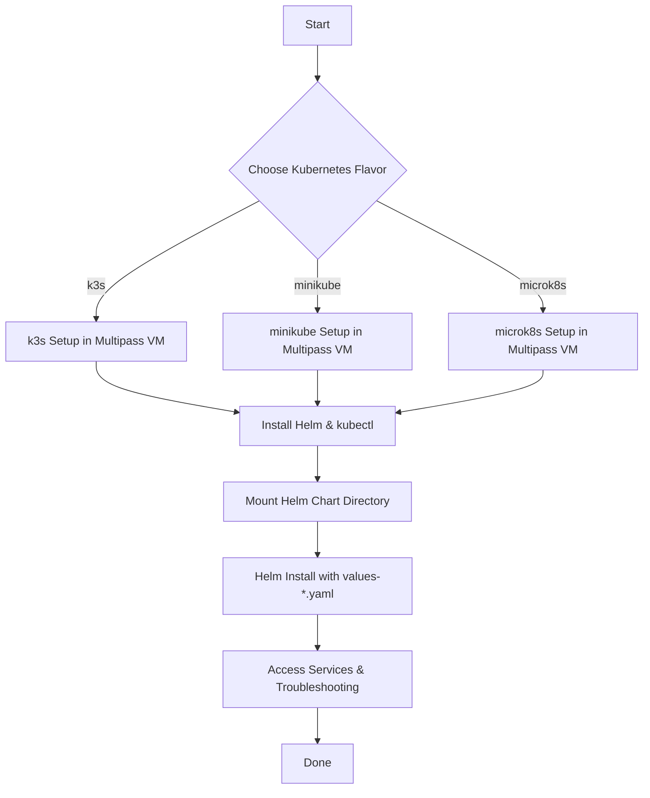

# Getting Started: Deploying the Wazuh Helm Chart with Multipass VMs

## Project Overview

This guide walks you through deploying the Wazuh Helm chart locally using popular lightweight Kubernetes distributions—**k3s**, **minikube**, and **microk8s**—inside Multipass-managed virtual machines. By the end, you'll have a working Wazuh stack running in a VM, suitable for testing, demos, or local development.

---

## Prerequisites

- **Multipass**: For managing VMs ([installation instructions](https://multipass.run/docs/installing-multipass))
- **kubectl**: Kubernetes CLI ([installation instructions](https://kubernetes.io/docs/tasks/tools/))
- **Helm**: Kubernetes package manager ([installation instructions](https://helm.sh/docs/intro/install/))
- **A supported OS**: Linux, macOS, or Windows with Multipass
- **Networking**: Multipass VMs are isolated from your host. To access services running in the VM, use `kubectl port-forward`, or set up Multipass NAT/bridged networking as needed.

---

## VM Specifications

|              | Minimum           | Recommended        |
|--------------|-------------------|-------------------|
| **vCPU**     | 2                 | 4                 |
| **RAM**      | 4 GB              | 8 GB              |
| **Disk**     | 20 GB             | 50 GB             |

For larger test environments or more intensive use, allocate more resources if possible.

---

## Using the Correct `values-*.yaml` File

This Helm chart provides tailored values files for each supported platform. Using the correct file ensures optimal configuration and compatibility.

| Kubernetes Flavor | Values File         | Why Use This File?                                         |
|-------------------|--------------------|------------------------------------------------------------|
| k3s               | `values-k3s.yaml`  | Configured for k3s defaults, storage, and networking.      |
| minikube          | `values-mkb.yaml`  | Tweaked for minikube’s storage and service exposure.       |
| microk8s          | `values-mks.yaml`  | Matches microk8s service, DNS, and storage conventions.    |

**Always reference the appropriate file with `-f` when installing/upgrading the chart. Do not use the default `values.yaml` unless you are customizing for advanced scenarios.**

---

## Overview Workflow



---

## 1. Launch a Multipass VM

Replace `<vm-name>` with a name for your VM (e.g., `wazuh-k3s`, `wazuh-mkb`, `wazuh-mks`):

```sh
# Recommended
multipass launch --name <vm-name> --cpus 4 --mem 8G --disk 50G

# Minimum (not recommended for production)
multipass launch --name <vm-name> --cpus 2 --mem 4G --disk 20G
```

---

## 2. Mount the Helm Chart Directory

Mount your local project directory (the one containing this chart) into the VM for easy access and live editing:

```sh
multipass mount /path/to/your/wazuh/charts/wazuh <vm-name>:/wazuh
```

Replace `/path/to/your/wazuh/charts/wazuh` with your actual local path.

---

## 3. Access the VM

```sh
multipass shell <vm-name>
```

All subsequent commands run inside the VM shell.

---

## 4. Install Kubernetes Distribution

### a) k3s

```sh
curl -sfL https://get.k3s.io | sh -
# Add kubectl to PATH
export KUBECONFIG=/etc/rancher/k3s/k3s.yaml
```

### b) minikube

```sh
# Install minikube
curl -LO https://storage.googleapis.com/minikube/releases/latest/minikube-linux-amd64
sudo install minikube-linux-amd64 /usr/local/bin/minikube
rm minikube-linux-amd64

# Start the cluster
minikube start --driver=none
```

### c) microk8s

```sh
sudo snap install microk8s --classic
sudo usermod -a -G microk8s $USER
sudo chown -f -R $USER ~/.kube
# Enable required services
microk8s status --wait-ready
microk8s enable dns storage
# (Optional) Alias kubectl
sudo snap alias microk8s.kubectl kubectl
```
Log out and back in if needed to refresh group membership.

---

## 5. Install Helm and kubectl (if not already present)

Most distributions provide `kubectl` already. To install Helm:

```sh
curl https://raw.githubusercontent.com/helm/helm/main/scripts/get-helm-3 | bash
```

For `kubectl` (if needed):

```sh
# Option 1: Use provided by k3s/minikube/microk8s
# Option 2: Install manually
curl -LO "https://dl.k8s.io/release/$(curl -L -s https://dl.k8s.io/release/stable.txt)/bin/linux/amd64/kubectl"
sudo install -o root -g root -m 0755 kubectl /usr/local/bin/kubectl
rm kubectl
```

---

## 6. Deploy the Wazuh Helm Chart

Navigate to the mounted chart directory:

```sh
cd /wazuh
```

Install (or upgrade) the chart, specifying the correct values file:

- **k3s:**
  ```sh
  helm upgrade --install wazuh . -f values-local.yaml -f values-k3s.yaml
  ```
- **minikube:**
  ```sh
  helm upgrade --install wazuh . -f values-local.yaml -f values-mkb.yaml
  ```
- **microk8s:**
  ```sh
  helm upgrade --install wazuh . -f values-local.yaml -f values-mks.yaml
  ```

---

## 7. Accessing Wazuh Services

Services are not directly exposed to your host by default. To access dashboards or APIs:

**Port forward an internal service (example):**
```sh
kubectl port-forward svc/wazuh-dashboard 5601:5601
```
Then open [http://localhost:5601](http://localhost:5601) on your host.

**Get all services:**
```sh
kubectl get svc
```

---

## 8. Tips & Troubleshooting

- **Pods not ready?** Check status:
  ```sh
  kubectl get pods
  kubectl describe pod <pod-name>
  kubectl logs <pod-name>
  ```
- **Storage issues?** Ensure the storage addon is enabled (minikube: `minikube addons enable storage-provisioner`, microk8s: `microk8s enable storage`).
- **Permission errors?** Make sure your user is in the correct groups (`microk8s`), and log out/in if needed.
- **Networking:** For advanced networking, see [Multipass networking docs](https://multipass.run/docs/networking).
- **Helm chart updates:** If you edit files on your host, changes are available in the VM instantly via the mounted directory.

---

## 9. Cleanup

To delete the VM and free resources:

```sh
multipass delete <vm-name>
multipass purge
```

---

## Additional Resources

- [Wazuh Documentation](https://documentation.wazuh.com/)
- [Helm Documentation](https://helm.sh/docs/)
- [Multipass Documentation](https://multipass.run/docs/)

---